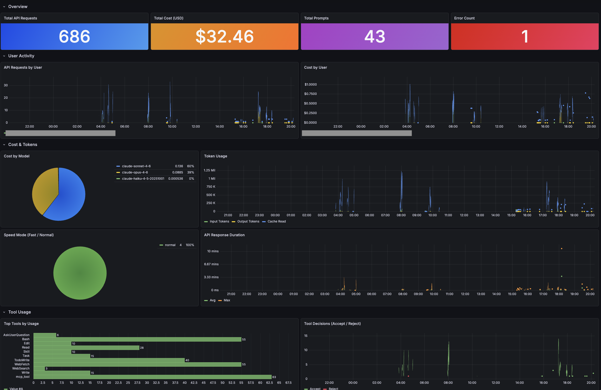

# Claude Cowork Grafana Dashboard

A Grafana dashboard for monitoring [Claude Cowork for Team](https://claude.com/docs/cowork) usage via OpenTelemetry.

Cowork sends telemetry events to Grafana Cloud (Loki) through its built-in OTLP integration. This dashboard visualizes that data using LogQL queries.

## Dashboard Sections

- **Overview** — Total API requests, cost (USD), prompt count, error count
- **User Activity** — Per-user API request and cost trends (grouped by `user_email`)
- **AI Utilization** — Sessions per user, prompts per user, avg prompts per session, Skill/MCP tool usage ranking, sub-agent usage
- **Best Practices** — Session split appropriateness (max vs avg prompts), personal skill growth, provided Skill adoption rate
- **Cost & Tokens** — Cost breakdown by model, token usage (input/output/cache), speed mode distribution, API response duration (avg/max)
- **Tool Usage** — Top tools ranking, tool accept/reject decisions
- **Harness Quality** — MCP tool error rate, tool rejection rate, provided Skill utilization
- **Errors** — Error count timeline and recent error log viewer

## Prerequisites

- Claude Cowork for Team with OpenTelemetry enabled (Admin settings > Cowork > Monitoring)
- Grafana Cloud account with Loki data source

## Setup

### 1. Configure Cowork OTLP Export

In the Cowork admin panel, set:

| Setting | Value |
|---|---|
| OTLP Endpoint | Your OTLP endpoint shown in Grafana Cloud Portal > Stack > Details > OpenTelemetry |
| OTLP Protocol | `http/protobuf` |
| OTLP Headers | `Authorization=Basic <base64(INSTANCE_ID:API_TOKEN)>` |

### 2. Import Dashboard

1. Open Grafana UI
2. Go to **Dashboards > New > Import**
3. Upload `dashboard.json` or paste its contents
4. Select your Loki data source when prompted

## Data Source

The dashboard uses a template variable `${logsDs}` for the Loki data source. You will be prompted to select it on import. Cowork events are stored with `service_name=cowork`.

## Notes

- Cowork exports **events/logs only** (not metrics). All queries are LogQL-based against Loki.
- Event fields (cost, tokens, user info, etc.) are stored as Loki **structured metadata**, not as JSON in the log body. Queries reference metadata fields directly without `| json`.
- The [Claude Code Stats](https://grafana.com/grafana/plugins/timurdigital-claudestats-app/) Grafana plugin requires Prometheus metrics and does **not** work with Cowork log data.

## References

- [Cowork Monitoring - Claude Docs](https://claude.com/docs/cowork/monitoring)
- [Monitoring - Claude Code Docs](https://code.claude.com/docs/en/monitoring-usage)
- [Grafana Cloud OTLP Guide](https://grafana.com/docs/grafana-cloud/send-data/otlp/)

## License

MIT
